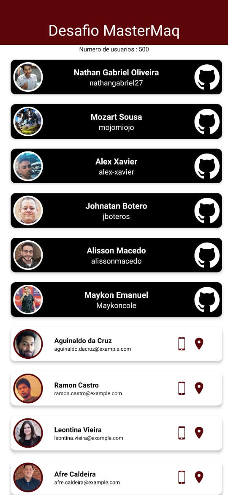
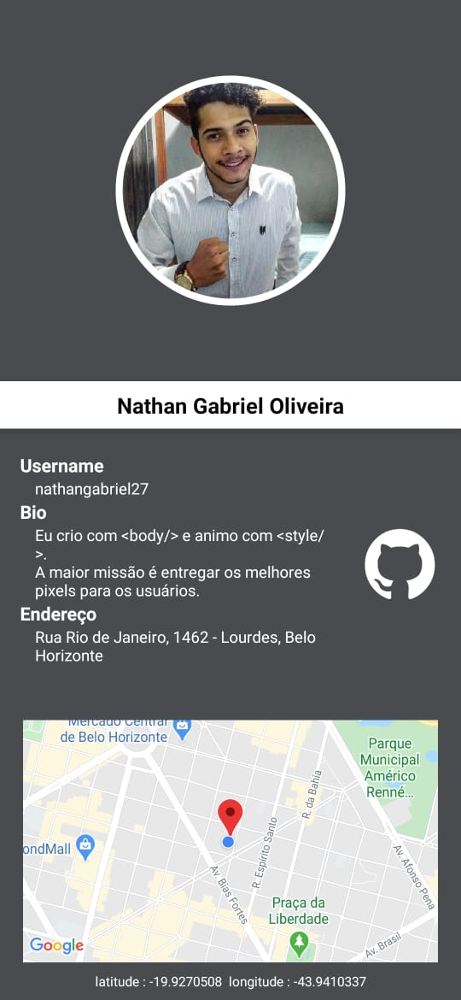
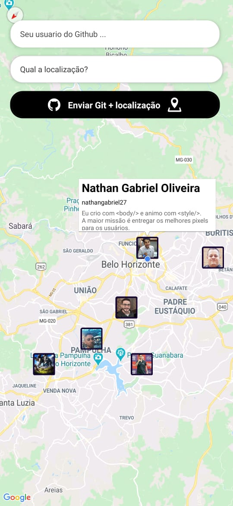
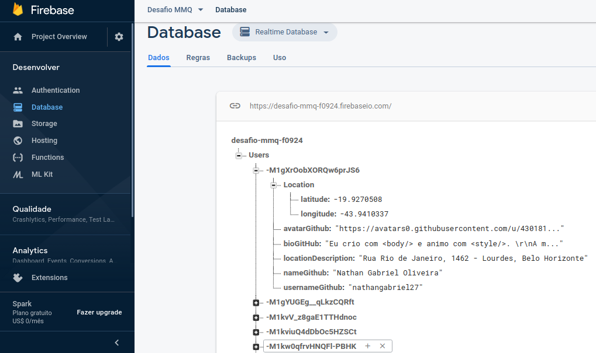

<h1 align="center">Desafio MMQ </h1>
Usando Expo e React Native criamos uma aplicação com Randomusers + GeocodingAPI + PlacesAPI + Firebase.


## 💻 Desafio MMQ 💻

- Aplicativo para testar os meus conhecimentos para processo seletivo interno;

- O desafio era usar uma API externa e transformar em dados  em uma aplicação mobile.
<p align="center">

## Explicação do APP
Clicando nos cards do Github é tranferido para a tela de detalhes, com os detalhes do cadastro feito com o username do GitHub. 

Clicando nos cards brancos, é transferido para a telade detalhes do usuario retornado pela API randouser.

<p align="center">

</p>

 Se for clicado no icon do GitHub é aberto uma navegador dentro da aplicação apresentando a pagina do usuario em questão no proprio site do GitHub. 

 <p align="center">


</p>


Clicando no Desfio MasterMAq da primeira tela 'Home', a aplicação e direciona a tela de cadastro de  usuario do GitHub onde se é cadastrado apenas o username e uma localização passada pelo usuario. 
Como background tem uma mapa com os usuarios e os dados requisitados a API do GitHub.
 <p align="center">

</p>

<!-- 
- This app was developed using React Naive + Expo.
 
 -->
</p>


## Para criar esta aplicação foram usadas diferentes APIs.

- API de usuarios randomicos.

<p>
API que retorna usuarios randomicos a cada nova requisição, de acordo com a documentação é possivel passar filtros na requisição e retornar um objeto JSON. 
</p>
Documentação: 

```sh
https://randomuser.me/

```

Uso 

```sh
https://randomuser.me/api/?results=1&nat=BR

```
- API Geocoding.

<p>
API verifica a geolocalização retornar um Json de informações sobre as coordenadas passadas. 
</p>
Documentação: 

```sh
https://developers.google.com/maps/documentation/geocoding/intro?hl=pt-br

```

- API PlacesAPI.

<p>
API da google que realiza um Seach dos locais e retorna dados como latitude e longitude, se o local for especifico, se tem o retorno com dados mais detalhados sobre o local. 
</p>
Documentação: 

```sh
https://developers.google.com/places/web-service/search?hl=pt

```

- API GitHub.

<p>
API que busca dados dos repositorios do GitHub e retorna JSON. Atravez dessa API se consegue todas as informações publicas do usuario.  
</p>
Documentação: 

```sh
https://developer.github.com/v3/
```
Uso: 
```sh
https://api.github.com/users/nathangabriel27
```
ou
```sh
https://api.github.com/users/nathangabriel27/repos
```

-  Banco de dados FireBase
<p>
Foi utilizado o banco de dados Firebase para armazenar os  dados, dados que são consumidos pela aplicação e em conjunto com as APIs se tem o retorno de outros dados que não sao armazenados. 
</p>

 <p align="center">



<!-- 
## Voce pode baixar o APk pelo link:

https://drive.google.com/open?id=1LUneROwyDupnszscATtpTit1zs5FrFhD

 -->


## 🎩 Dependencias do desenvolvimento

Um gerenciador de pacotes como o yarn ou npm para baixar as dependências do projeto.


Documentação npm: 

    https://www.npmjs.com/get-npm

Documentação yarn: 

    https://classic.yarnpkg.com/en/docs/install/#windows-stable

Instalar o Expo CLI que é a estrutura de execução da plataforma para o React. 

Usando npm para a instalação do Expo
```sh
npm install -g expo-cli
```
Usando npm para a instalação do Expo
```sh
yarn global add expo-cli
```

- Agora so usar Git para clonar o repositório. 
- Executar no terminal:

```sh
$ git clone https://github.com/nathangabriel27/Desafio-MMQ
```
```sh
$ cd Desafio-MMQ 
```
```sh
$ sudo expo start
```


Documentação Expo: https://docs.expo.io/versions/latest/

Obrigado!!